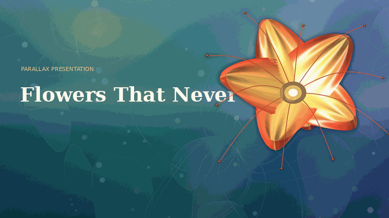
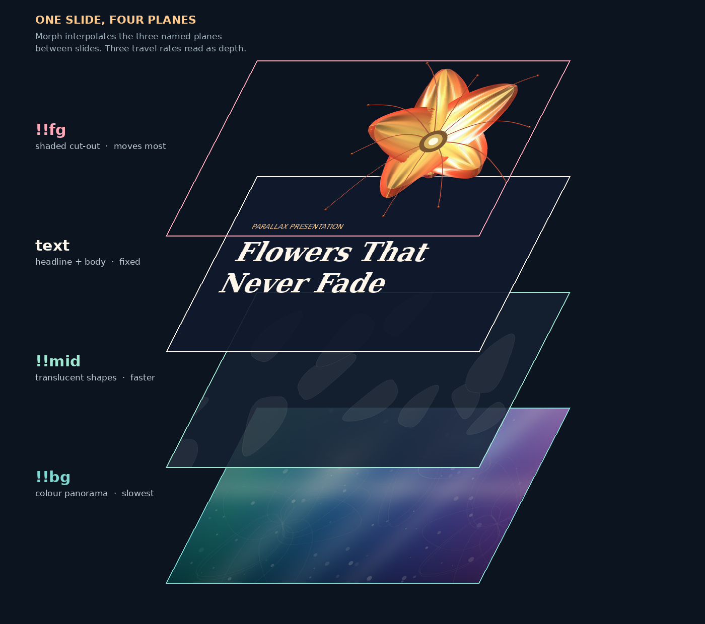
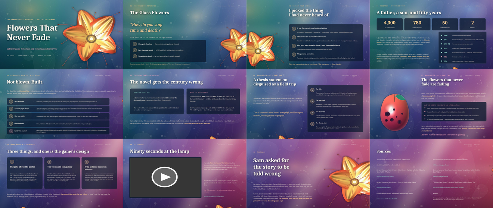

<div align="center">

# Parallax PPTX

**Slide decks that move like a camera, not a slideshow.**



*Real output. The panorama drifts, the midground overtakes it, the subject crosses the frame — and the headline runs **behind** the flower.*

</div>

---

## What this is

A skill and a toolchain for building **parallax presentations** as real `.pptx`
files. Every slide is the same three planes shot from a different camera
position. PowerPoint's Morph transition interpolates between those positions, and
because the planes travel at three different rates, the eye reads depth.

No plugin. No video export. It opens in PowerPoint like any other deck.

<div align="center">

</div>

The order is the whole trick. Type is added **between** the midground and the
cut-out, so the subject occludes the headline — that one moment is what people
remember about a deck like this.

| plane | shape name | travel per slide | job |
|---|---|---|---|
| panorama | `!!bg` | ~1.7 in | colour and mood; ~2.4 screens wide, so the deck's palette evolves as you advance |
| midground | `!!mid` | ~2.5 in | the plane that proves there *is* depth |
| type | — | fixed | headline and body |
| cut-out | `!!fg` | 4–12 in, plus scaling | the subject; crosses the type |

---

## Four commands

In a hurry? `npm install && npm run example` runs all of it and leaves a
morph-patched `deck.pptx` in the repo root. The long way:

```bash
npm install pptxgenjs
pip install numpy pillow

cd skills/parallax-presentation/scripts

# 1 — build the three planes (palette taken from a reference image if you have one)
python3 generate_layers.py --out layers/ --palette-from reference.jpg

# 2 — author content as JSON, build the deck
node build_deck.js ../../../examples/glass-flowers/deck.json --layers layers/ --out deck.pptx

# 3 — add the Morph transitions (pptxgenjs can't write them; see below)
python3 morph_patch.py deck.pptx

# 4 — check the motion without opening PowerPoint
python3 preview_gif.py --layers layers/ --out preview.gif
```

---

## Every deck is a different deck

The three-plane rig is the only thing that repeats. Everything that gives a deck
its identity is an input you supply:

| what changes | how |
|---|---|
| palette | `--palette-from photo.jpg`, or `--hues "0B2E4F,1E6F6B,C2410C"` |
| the subject on the near plane | `--cutout subject.png` — any RGBA cut-out |
| the built-in subject's colours | `--bloom-in` / `--bloom-out` / `--bloom-tip`, `--petals` |
| structure, copy, layout order | your own `deck.json` |

The example further down is about glass flowers because that deck wanted a
flower. A deck on subsea cable repair gets a cable ship on the near plane, a
cold blue-green panorama, and the same camera move.

---

## The near plane is rendered, not drawn

If you don't hand it a cut-out, `generate_layers.py` renders one. The default
subject is a bloom: each petal is a parametric surface — width profile, cup,
ruffle, twist — meshed into roughly 3,000 quads, lit with diffuse + specular +
**back-lit translucency** (the term that makes thin glass look like thin glass)
+ rim light, then depth-sorted and painted back to front.

Recolour it with the `--bloom-*` flags, or pass `--cutout` and skip the renderer
entirely. Either path gets the same dark separation halo — without it the near
plane dissolves into the panorama.

Panorama colours come from the reference image if you pass one. `--palette-from`
quantises the image, drops near-blacks, sorts what's left by hue, and deepens it
so cream type stays legible on top.

---

## Layouts

Twelve slide types, each tuned so text never collides with the moving subject.
Dense slides push the cut-out 80% off canvas — a single arc of the subject at the
bottom edge is enough to keep the depth reading.

`title` · `quote` · `list` · `stats` · `steps` · `compare` · `split` ·
`feature` · `cards` · `video` · `closing` · `references`

Authoring is JSON. Inline `**double asterisks**` become accent-coloured bold:

```json
{
  "type": "steps",
  "eyebrow": "03  how a break is fixed",
  "title": "Grapple, cut, splice.",
  "intro": "A repair ship drags a **grapnel** along the seabed until it snags the cable.",
  "steps": [
    { "label": "Locate the fault", "text": "Pulse the line from shore and time the echo." },
    { "label": "Splice and test", "text": "Fibres fused by hand in a moving sea state.", "accent": true }
  ]
}
```

Full field reference: [`reference/SCHEMA.md`](skills/parallax-presentation/reference/SCHEMA.md)

---

## Why `morph_patch.py` has to exist

Morph is a Microsoft extension, not part of the base OOXML schema, so no
JavaScript pptx library writes it. The patcher injects it into the packed XML
after `</p:clrMapOvr>` — wrapped in `mc:AlternateContent` with a plain fade in
`mc:Fallback`, so older readers degrade instead of breaking:

```xml
<mc:Choice xmlns:p159="...powerpoint/2015/09/main" Requires="p159">
  <p:transition spd="slow" p14:dur="1600">
    <p159:morph option="byObject"/>
  </p:transition>
</mc:Choice>
```

It also renames the three pictures to `!!bg`, `!!mid`, `!!fg`. A shape name
starting with `!!` is an **explicit** morph match: PowerPoint pairs it with the
same name on the next slide and interpolates position and scale, instead of
guessing. With three big overlapping pictures per slide, guessing gives you a
blink. Explicit matching gives you a camera move.

Details: [`reference/TECHNIQUE.md`](skills/parallax-presentation/reference/TECHNIQUE.md)

---

## One worked example

<div align="center">

</div>

This is **one** deck, not a house style — a twelve-slide research deck on the
Harvard Glass Flowers, kept in the repo because it exercises every layout in the
schema. Its palette, subject and copy came from its own inputs; yours will look
nothing like it.

Source and build steps: [`examples/glass-flowers/`](examples/glass-flowers/)

---

## Using it as a skill

Drop `skills/parallax-presentation/` into your skills directory. It triggers when
someone asks for a parallax deck, a cinematic or depth-based presentation, a deck
"like that video", or hands over a reference image to build a deck around.

The skill file is opinionated about process, not just mechanics: research from
primary sources before touching the design, keep to the provided layouts, render
the deck to images and actually look at every slide before handing it over.

---

## Design rules

- **Never black.** The panorama sweeps a hue range; the darkest value is a deep
  saturated colour. Type is cream (`FFF7EC`), never pure white.
- **One accent.** Gold for emphasis, rose reserved for the single slide carrying
  the twist.
- **The cut-out needs a dark separation halo** or it dissolves into the
  panorama. Added automatically.
- **Peek, don't crowd.** Full-frame subject is for the title and closing slides
  only.
- **Scrims, not cards.** Text panels sit at 20–30% transparency so the panorama
  still reads through them.

---

## Limits

- Morph needs **PowerPoint 2019 or Microsoft 365**. Keynote, Google Slides and
  LibreOffice fall back to the fade.
- The panorama is embedded once per slide, so a twelve-slide deck runs **30–40 MB**.
  Lower `--pano-width` if you have an upload cap.
- Embedded online video needs a live connection when you present.

---

## Requirements

`node` + `pptxgenjs` · `python3` + `numpy`, `pillow` · `zip` on PATH ·
optional `libreoffice` and `poppler-utils` for the render-and-check step.

## License

MIT. All artwork in this repository is generated by the code in this repository.
