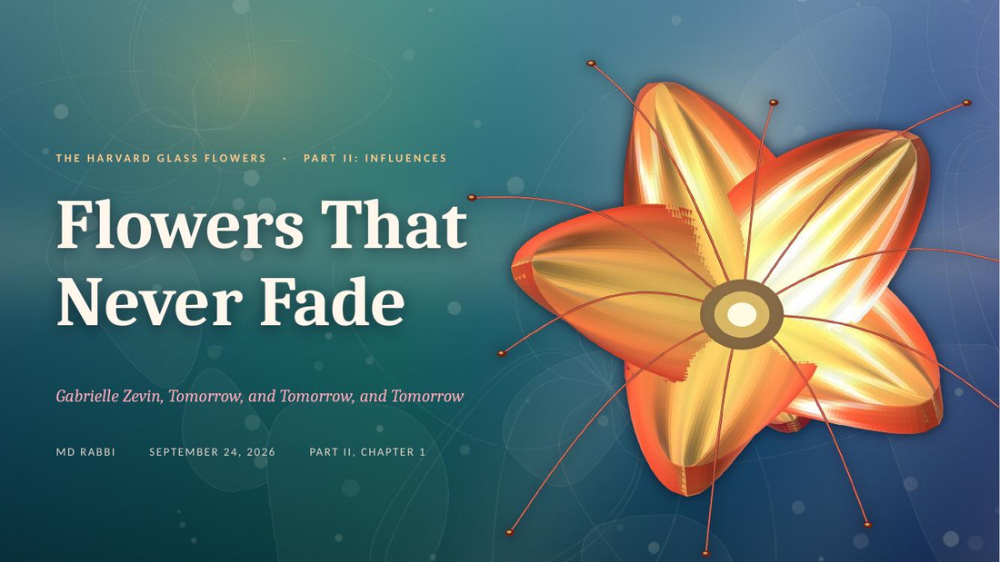
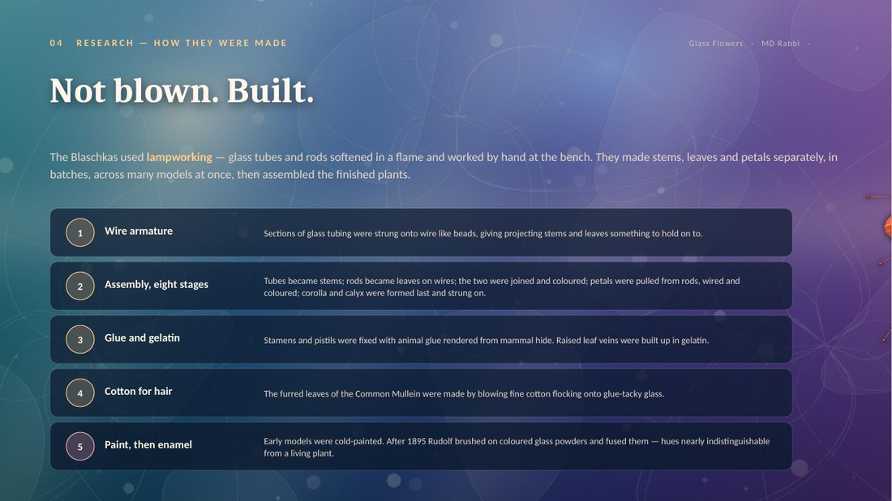
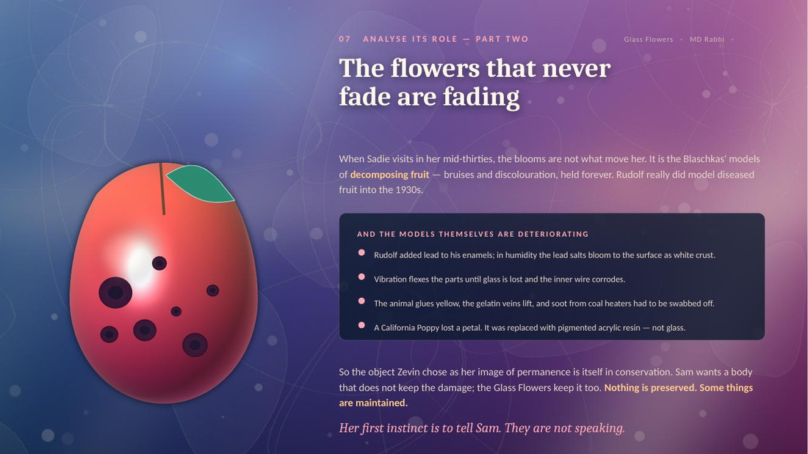
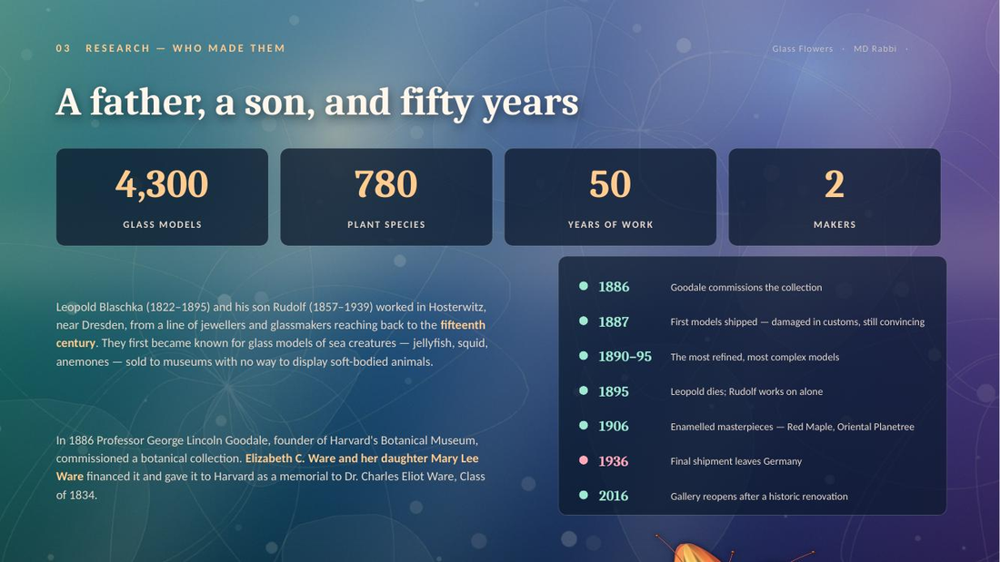

# Example — Flowers That Never Fade

A complete twelve-slide parallax deck: a pop-culture reference analysis of the
Harvard Glass Flowers as they appear in Gabrielle Zevin's *Tomorrow, and
Tomorrow, and Tomorrow*.

<div align="center">

<br><br>

<br><br>

<br><br>

</div>

*Slides from this deck specifically. The palette and the subject came from this
deck's inputs — a different topic produces a different-looking deck.*

It exercises every layout in the schema — title, pull quote, numbered list,
stats with a timeline, a numbered process, a two-panel comparison, a split
argument, an image-led feature with a highlighted panel, three cards, an
embedded video, a closing statement and references.

## Build it

```bash
cd ../../skills/parallax-presentation/scripts
python3 generate_layers.py --out layers/
node build_deck.js ../../../examples/glass-flowers/deck.json --layers layers/ --out deck.pptx
python3 morph_patch.py deck.pptx
```

The `feature` slide references a second cut-out, `fruit.png`. Generate one with
your own subject, or delete the `"fgAsset"` line to fall back to `bloom.png`.

## Research sources

Content is drawn from the Harvard Museum of Natural History's own pages on the
Ware Collection and "From the Hands of the Makers", plus the Corning Museum of
Glass. All of it is cited on the deck's references slide.
